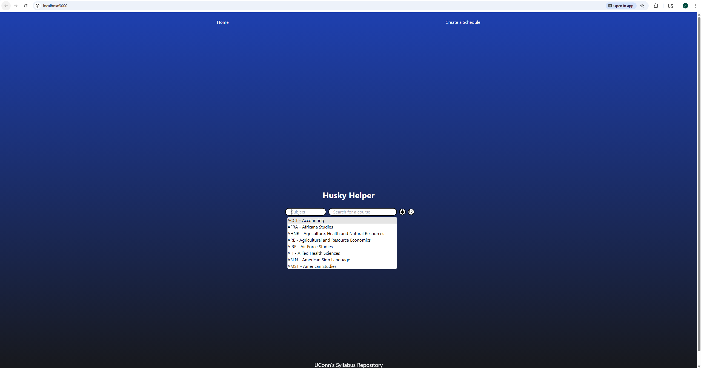
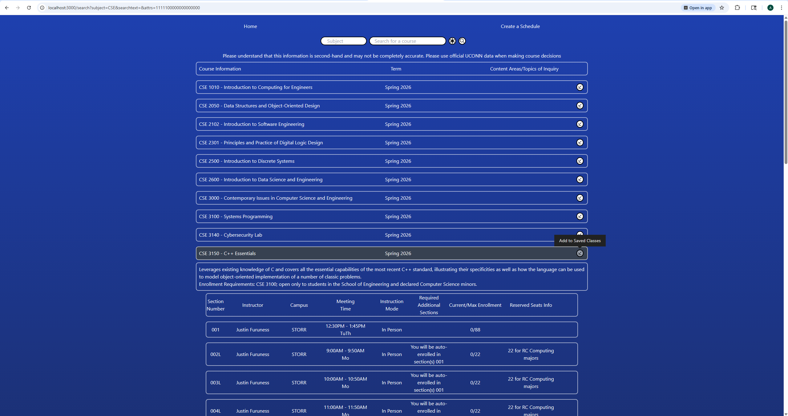
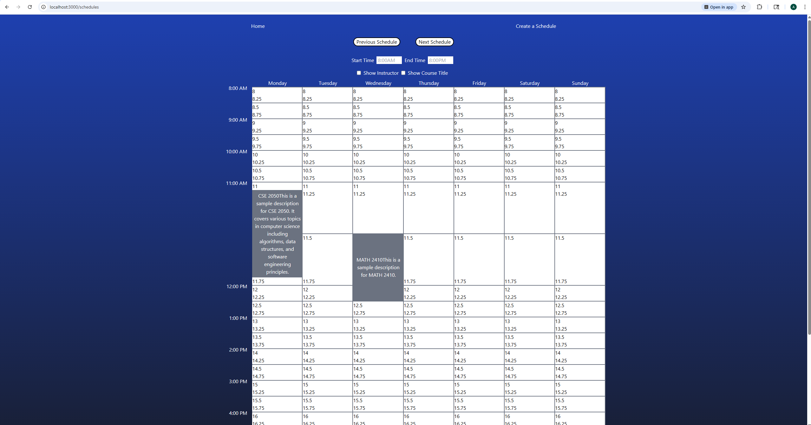

# HuskyHelper
Fullstack web application for university students to search for classes and create schedules based on user-preferences.

## to do:
    - scheduling algorithm
    - display table format of current schedule from the algorithm with attributes like credits, time, section, MoWeFr, etc
    - add your own course or timeslot (like lunch break) on SavedCourses page
    - remove class from search if no sections populate for the course (when searching for a specific campus)
    - add semester attribute functionality (i.e. spring 2026 unchecked should show no courses)
    - only include A-Z in search + sort by abbreviation in search
    - react-error-boundary for error handling

## future:
    - update database with current/future semester data
    - hosting site for server and website

- optionally update SearchForm attribute button for better UX/UI
- optionally update title page with husky ascii art
- optionally add Rate my professor ratings: https://github.com/tisuela/ratemyprof-api/tree/master

## Work In Progress Website Images

####Landing Page

####Search Query Page

####Saved Courses Page

####Create Schedule Page

